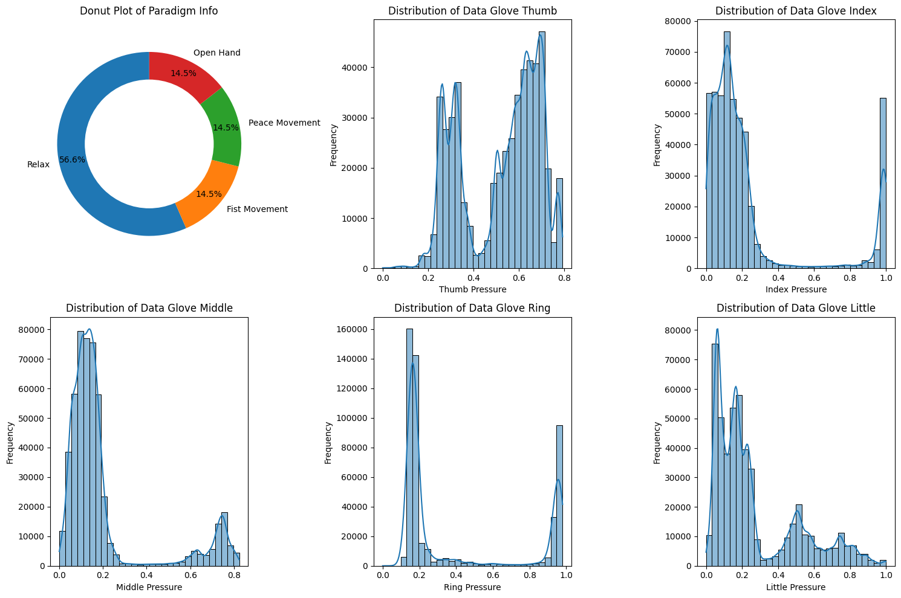
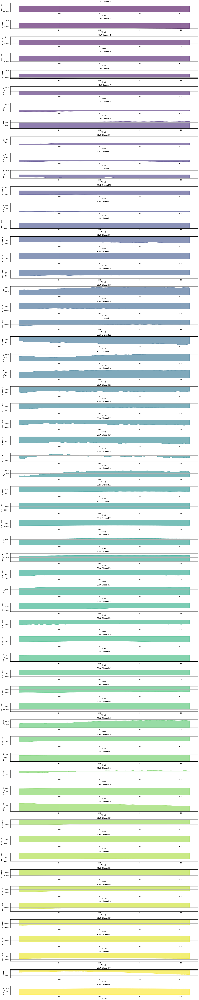
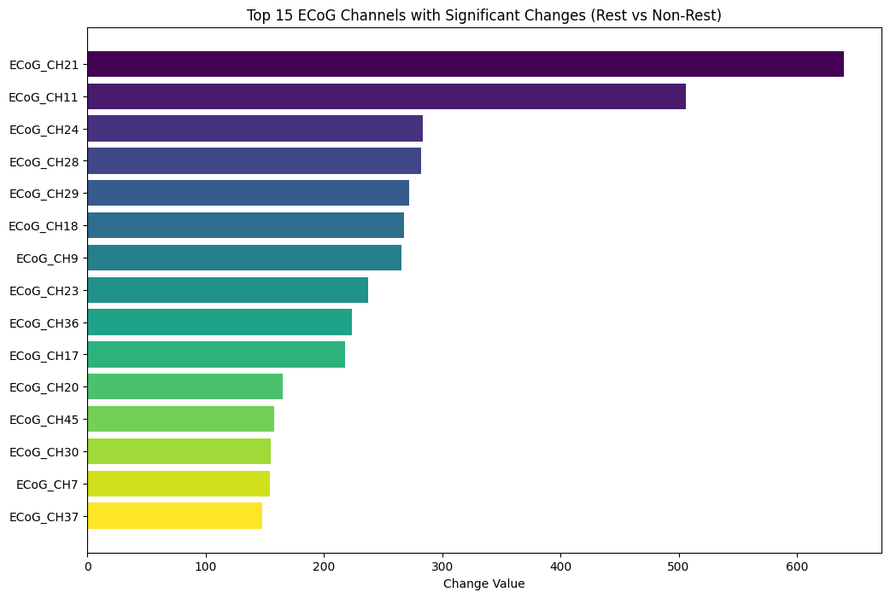
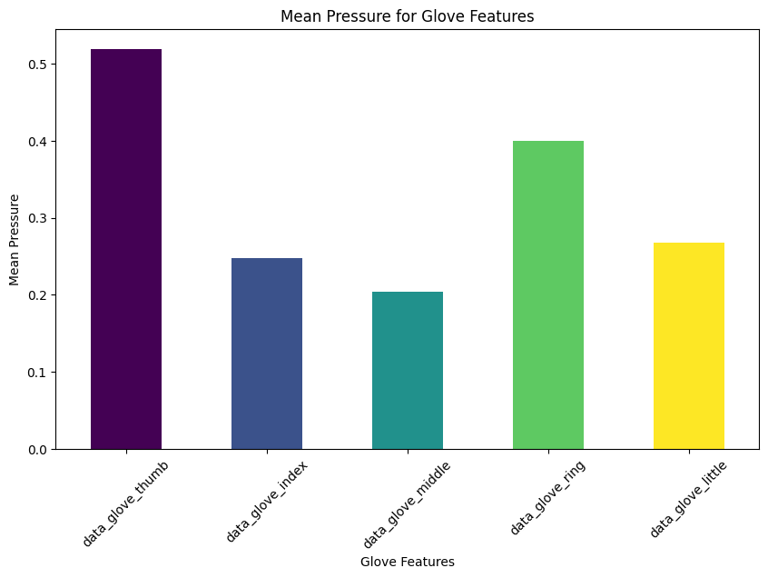
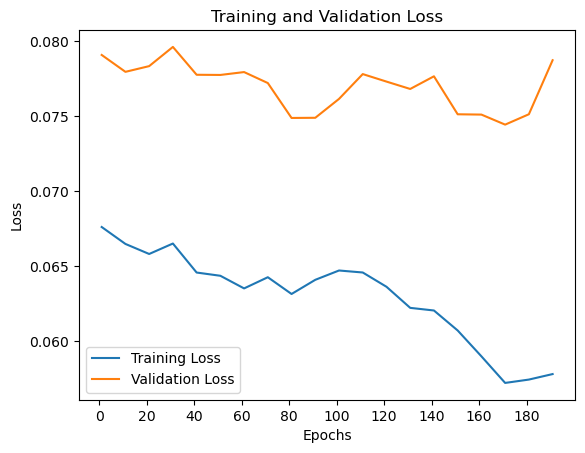
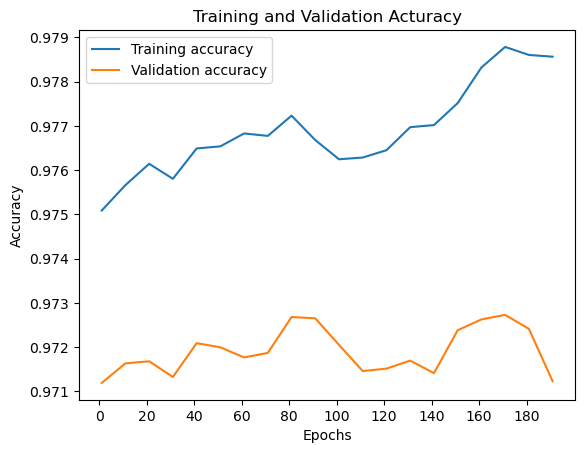

## 📖 Abstract  
In this project, we investigate the use of **Electrocorticography (ECoG) signals** ⚡ combined with **data glove sensor readings** 🧤 to decode and classify **hand movements** into four categories: Relax, Fist, Peace, and Open Hand.  
We employ **signal preprocessing, exploratory data analysis (EDA), feature extraction, and deep learning (LSTM)** to build an end-to-end brain-computer interface (BCI) pipeline.  

---

## 1️⃣ Introduction  
Brain–Computer Interfaces (BCIs) aim to decode neural activity into actionable outputs.  
In this study, we focus on **hand gesture decoding** by leveraging:  
- **60 ECoG channels** (brain signals)  
- **5 glove pressure sensors** (thumb, index, middle, ring, little)  
- **Paradigm information** (ground-truth movement labels)  

Goal: Develop a robust pipeline for **ECoG-based gesture recognition** using **deep learning**.  

---

## 2️⃣ Dataset  
- **File:** `ECoG_Handpose.mat`  
- **Channels (CH1–CH60):** ECoG recordings  
- **Glove Sensors:** Finger pressures  
- **Paradigm Labels:**  
  - `0` → Relax 🛑  
  - `1` → Fist ✊  
  - `2` → Peace ✌️  
  - `3` → Open Hand 🖐️  

---

## 3️⃣ Exploratory Data Analysis (EDA)  

### 3.1 Glove Sensor Distribution  
We analyze the statistical distribution of finger pressures.  

### 🔹 Donut chart of paradigm label distribution & Histogram + KDE plots for each finger (Thumb, Index, Middle, Ring, Little)

### 3.2 Temporal Signal Visualization  

- **ECoG Channel Activity** across 60 channels  

### 🔹 Multi-channel plot of ECoG signals (CH1–CH60)

### 3.3 Rest vs. Movement Conditions  
Comparison of **Relax (Paradigm=0)** vs **Active Movements (Paradigm ≠ 0)**.  

---

## 4️⃣ Feature Engineering  

- Dropped redundant channel (`ECoG_CH61`)  
- Segmented signals using **time windows** (length=16, 50% overlap)  
- Normalized features with **StandardScaler**  
- Combined **ECoG + glove signals**  

### 🔹 Bar plot of Top 15 ECoG channels with most significant changes (Rest vs Non-Rest)

### 🔹 Bar plot of mean pressures for glove features

---

## 5️⃣ Model Architecture  

We implemented a **2-layer LSTM classifier**:  

- **Input:** `(segment_length × features)`  
- **Hidden Units:** 128  
- **Dropout:** 0.3  
- **Output:** 4-class classification  
- **Optimizer:** Adam (LR=0.005, L2=0.001)  
- **Loss:** Cross-Entropy  

---

## 6️⃣ Training & Evaluation  

- **Epochs:** 1000  
- **Batch size:** Full test set size  
- **Device:** GPU/CPU auto-detected  
- **Metrics:** Accuracy, AUC, Classification Report  

### 🔹 Training vs Validation Loss curve

### 🔹 Training vs Validation Accuracy curve

---

## 7️⃣ Results  

- **Best Test Accuracy:** ~98%  

The model successfully classified hand movements from raw ECoG + glove signals, demonstrating the potential of LSTMs in BCI tasks.  

---

## 8️⃣ Conclusion & Future Work  

This work shows the feasibility of decoding **hand gestures from ECoG** using deep learning. Future directions include:  
- Exploring CNN-LSTM hybrid architectures 📈  
- Real-time signal decoding ⏱️  
- Transfer learning across subjects 🌍  

---
